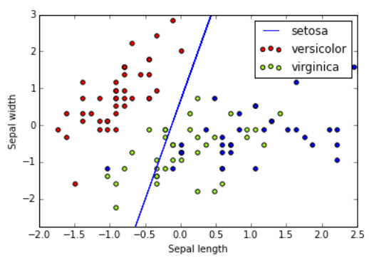

# Classifying Irisses

This is a classic [scikit-learn](http://scikit-learn.org/stable/index.html) example. Our goal is to get a gentle introduction to scikit-learn in general and the [Stochastic gradient descent](https://en.wikipedia.org/wiki/Stochastic_gradient_descent)(SGD) method in general. All SGD problems are classification problems. In this case, there are three different species an iris might fall into. We have various measurments of individual flowers and want to determine some equation that will separate the flowers from each other.

## Methods

You will find the complete process in the iPython notebook [here](4_sgd.ipynb).

* First, we load the iris data set that comes stock with scikit-learn: `from sklearn.datasets import load_iris`, `iris = load_iris()`.
* Then we break the data 3:1 into trainging and testing data sets: `from sklearn.cross_validation import train_test_split` and `train_test_split(x, test_size=0.25)`,
* Then we normalize the sepal measurments (independent variables) so they have an average of 0.0 and a standard deviation of 1.0.
 * This is so that when we are weighting the variables, no variable appears more important purely because it has larger values.
 * `scaler_x = preprocessing.StandardScaler().fit(x_train)` then `x_train = scaler_x.transform(x_train)`
* Then we make a quick test plot of our three types of iris flowers given our two measurments of choice.
* Then we create an SGD Classifier object and pass it our data: `clf = SGDClassifier()` and `clf.fit(x_train, y_train)`.
* The Classifier object calculates three lines, one to separate each species of flowers from the other two.

## RESULTS

In the end, we choose only two variables to try and differentiate the three species of irises: sepal length and sepal width. Perhaps more variables would have given us better separation. As it stand, we defined the equation of three lines that separate one species from the other two. Though only one of these lines is particularly pleasing:

